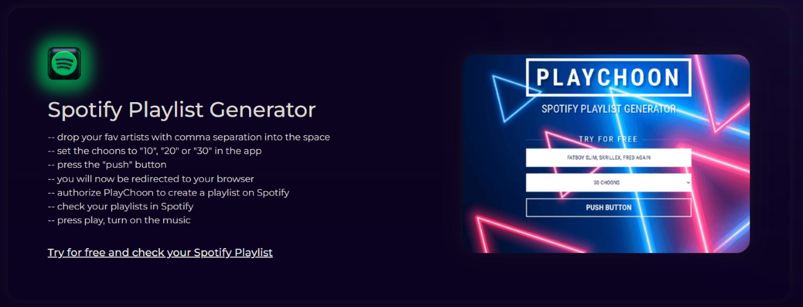

<div align='center'>


# PlayChoon
<p>This is a simple tool to generate a playlist on Spotify based on your favorite artists.</p>

<h4> <a href=https://playchoon.vercel.app/>View Demo</a> <span> · </span> <a href="https://github.com/sasaisaschi/playchoon/blob/master/README.md"> Documentation </a> <span> · </span> <a href="https://github.com/sasaisaschi/playchoon/issues"> Report Bug </a> <span> · </span> <a href="https://github.com/sasaisaschi/playchoon/issues"> Request Feature </a> </h4>
</div>

## Table of Contents

- [About the Project](#about-the-project)
- [Getting Started](#getting-started)
  - [Run Locally](#run-locally)
  - [Environment Variables](#environment-variables)
- [Disclaimer](#disclaimer)
- [Demo](#demo)


## About the Project

Craft personalized playlists in seconds with PlayChoon, the Spotify Playlist Generator.

- Effortless Setup: Simply enter your favorite artists and desired song count.
- Tailored Tunes: Receive a unique playlist curated just for your musical taste.
- Seamless Integration: Connects directly with your Spotify account for effortless playlist creation.
- Elevate Your Listening: Enjoy a personalized musical experience with PlayChoon.
-  <a href=https://playchoon.vercel.app/>Try for free and check your Spotify Playlist</a>

### Screenshots

<div align="center"> <a href="https://playchoon.vercel.app/"></a> </div>

## Getting Started

### Run Locally

Clone the project

```bash
https://github.com/sasaisaschi/playchoon.git
```

Go to the project directory
```bash
cd playchoon
```

Virtual environment
```bash
python -3.11 -m venv .venv
```

Activate environment
```bash
.venv\Scripts\activate
```

Install requirements
```bash
pip install -r requirements.txt
```

Serving Flask app
```bash
python api\app.py
```

Running on
```bash
http://127.0.0.1:5000
```

### Environment Variables
To run this project locally, you will need to add the following environment variables to your .env file.

`SPOTIFY_CLIENT_SECRET=`

`SPOTIFY_CLIENT_ID=`

Get your Spotify API credentials from [Spotify Developer Dashboard](https://developer.spotify.com/dashboard/applications).
Click on 'Create an App'. Pick an 'App Name' and 'App Description' of your choice and mark the checkboxes. After creation, you see your 'Client ID' and you can click on 'Show Client Secret` to unhide your 'Client Secret'. Use your 'Client ID' and 'Client Secret' to retrieve a token from the Spotify API.

## Disclaimer

This project is for educational purposes only. The project is not intended for commercial use. The project is not affiliated with Spotify.

## Demo

You can try the generator demo at [https://playchoon.vercel.app/](https://playchoon.vercel.app/).