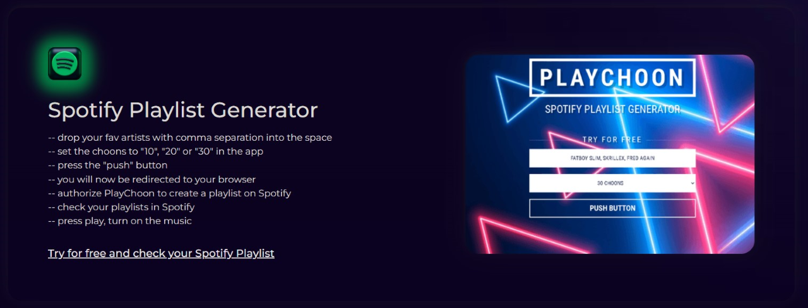

<div align='center'>


# PlayChoon
<p>This is a simple tool to generate a playlist on Spotify based on your favorite artists.</p>

<h4> <a href=https://playchoon.vercel.app/>View Demo</a> <span> · </span> <a href="https://github.com/sasaisaschi/playchoon/blob/master/README.md"> Documentation </a> <span> · </span> <a href="https://github.com/sasaisaschi/playchoon/issues"> Report Bug </a> <span> · </span> <a href="https://github.com/sasaisaschi/playchoon/issues"> Request Feature </a> </h4>
</div>

## Table of Contents

- [About the Project](#about-the-project)
- [Getting Started](#getting-started)
  - [Run Locally](#run-locally)
  - [Environment Variables](#environment-variables)
- [Disclaimer](#disclaimer)
- [Demo](#demo)


## About the Project

Craft personalized playlists in seconds with PlayChoon, the Spotify Playlist Generator.

- Effortless Setup: Simply enter your favorite artists and desired song count.
- Tailored Tunes: Receive a unique playlist curated just for your musical taste.
- Seamless Integration: Connects directly with your Spotify account for effortless playlist creation.
- Elevate Your Listening: Enjoy a personalized musical experience with PlayChoon.
-  <a href=https://playchoon.vercel.app/>Try for free and check your Spotify Playlist</a>

### Screenshots

<div align="center"> <a href="https://playchoon.vercel.app/"></a> </div>

## Getting Started

### Run Locally

Clone the project

```bash
https://github.com/sasaisaschi/playchoon.git
```

Go to the project directory
```bash
cd playchoon
```

Virtual environment
```bash
python -3.11 -m venv .venv
```

Activate environment
```bash
.venv\Scripts\activate
```

Install requirements
```bash
pip install -r requirements.txt
```

Serving Flask app
```bash
python api\app.py
```

Running on
```bash
http://127.0.0.1:8888
```

### Environment Variables
To run this project locally, you will need to add the following environment variables to your `.env` file.

`SPOTIFY_CLIENT_ID=`

`SPOTIFY_CLIENT_SECRET=`

`SECRET_KEY=`

`BASE_URL=http://localhost:8888`

**SPOTIFY_CLIENT_ID / SPOTIFY_CLIENT_SECRET** – Get your Spotify API credentials from the [Spotify Developer Dashboard](https://developer.spotify.com/dashboard/applications). Click *Create an App*, enter a name and description, then copy your *Client ID* and *Client Secret*. Add `http://localhost:8888/callback` as a Redirect URI in the app settings.

> ⚠️ **Note:** Spotify requires a **Premium subscription** on the developer account to access the Web API. Without Premium, playlist generation will be blocked by Spotify.

**SECRET_KEY** – Any long random string used to sign Flask sessions. Example: `openssl rand -hex 32`

**BASE_URL** – The base URL of the running app. Use `http://localhost:8888` locally, `https://playchoon.vercel.app` in production.

#### Vercel Deployment
Set the same four variables in your Vercel project:
**Dashboard → playchoon → Settings → Environment Variables**

## Disclaimer

This project is for educational purposes only. The project is not intended for commercial use. The project is not affiliated with Spotify.

## Demo

You can try the generator demo at [https://playchoon.vercel.app/](https://playchoon.vercel.app/).